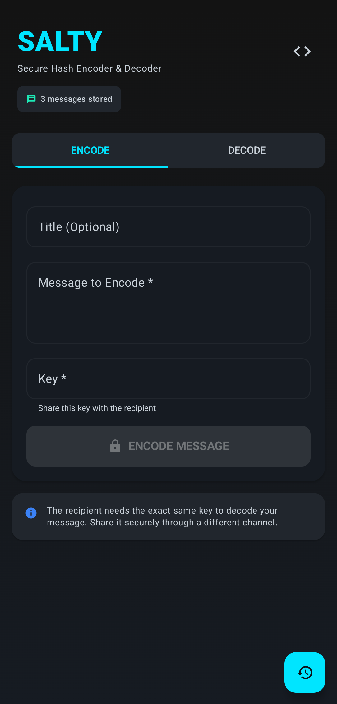
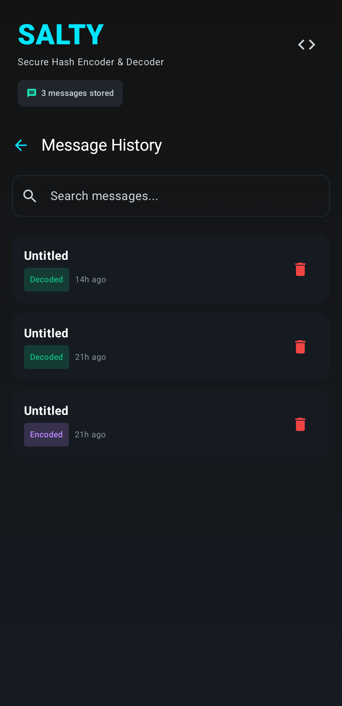

<div align="center">

# Salty App

<p align="center">
  
</p>


*Exchange sensitive information securely by encrypting messages with a shared "Salt" (Key). Built with a strict focus on privacy and modern design, it utilizes AES-256-GCM encryption and stores all history locally on your device.*

</div>

<br>

## 🔎 Features
*   **Secure Encryption:** Industry-standard AES-256 with PBKDF2 (600,000 iterations).
*   **Modern Design:** Sleek Material Design 3 interface with an expressive dark mode.
*   **Offline Privacy:** Zero analytics, zero cloud sync[cite: 1]. Your data stays completely on your phone.
*   **Intuitive Workflow:** Simple, easily navigable tabs for Encoding, Decoding, and History management.

<br>

## 📸 Screenshots
<div align="center">
  
  
</div>

<br>

## 🛠 Tech Stack
*   **Language:** Kotlin
*   **UI Framework:** Jetpack Compose
*   **Architecture:** MVVM
*   **Local Data:** Room Database
*   **Asynchronous Programming:** Coroutines & Flow

<br>

## 🚀 Quick Start
Get the latest version of the app through your preferred privacy-focused marketplace.

<a href="https://f-droid.org/packages/com.vauth.salty">
  
</a>
<a href="https://apt.izzysoft.de/packages/com.vauth.salty">
  
</a>

<br>

## ⚙️ Building
* #### Clone Repository:
```bash
git clone https://github.com/vauth/salty-app.git
cd salty-app
   ```
* #### Build and Install:
```bash
gradle :app:assembleRelease --no-daemon
```
*(Note: If you are using Windows, use `gradlew.bat` instead of `./gradlew`)*

<br>

## 🤝 Contributing
Contributions are welcome! Feel free to submit a pull request or report an issue.

<br>

## 📄 License
This project is licensed under the MIT License - see the [LICENSE](LICENSE) file for details.
